## the geneale vew of the project goals

```mermaid
flowchart TD
    subgraph Client["Client Environment (Browser Extension)"]
        UI[/"User Interface"/]
        KG["Key Generation\n(RSA 4096-bit & AES-256)"]
        LE["Local Encryption Module"]
        LD["Local Decryption Module"]
        BIO["Biometric Auth Module"]
        SKS["Secure Key Storage\n(Protected Memory)"]

        UI --> |"1. Init Request"| KG
        KG --> |"2. Store Keys"| SKS
        UI --> |"3. Auth Request"| BIO
        BIO --> |"4. Verify"| SKS
    end

    subgraph WebApp["Web Application (Next.js)"]
        API["API Layer\n(Rate Limited)"]
        AUTH["Auth Service\n(Zero Knowledge)"]
        STORE["Encrypted Storage"]
        AUDIT["Audit Logger"]

        API --> |"Verify"| AUTH
        API --> |"Log Access"| AUDIT
        API <--> |"Read/Write"| STORE
    end

    subgraph Org["Organization Management"]
        RBAC["Role-Based Access Control"]
        TEAM["Team Management"]
        VAULT["Password Vaults"]

        RBAC --> |"Control"| TEAM
        TEAM --> |"Access"| VAULT
    end

    %% Data Flow Lines
    UI <--> |"5. HTTPS/TLS 1.3\nPerfect Forward Secrecy"| API

    %% Security Measures
    classDef securityCheck fill:#f96,stroke:#333,stroke-width:2px
    class KG,AUTH,RBAC securityCheck

    %% Critical Data Points
    classDef criticalData fill:#f66,stroke:#333,stroke-width:4px
    class SKS,STORE criticalData

    %% Security Notes
    note1["🔒 All data encrypted\nbefore transmission"]
    note2["⚠️ Potential Memory\nDump Vulnerability"]
    note3["🔑 Key rotation every\n30 days"]
    note4["📝 Audit logs encrypted\nbut searchable"]

    note1 --> LE
    note2 --> SKS
    note3 --> KG
    note4 --> AUDIT

    %% Data Flow Details
    subgraph DataFlow["Data Flow Security"]
        direction TB
        E1["1. Data Encryption (AES-GCM)"]
        E2["2. RSA Signature"]
        E3["3. TLS Encryption"]
        E4["4. Zero-Knowledge Proof"]

        E1 --> E2 --> E3 --> E4
    end

    subgraph KeyStorage["Key Management"]
        direction TB
        K1["1. Master Key (RSA-4096)"]
        K2["2. Derived Keys (PBKDF2)"]
        K3["3. Session Keys"]
        K4["4. Biometric Keys"]

        K1 --> K2 --> K3 --> K4
    end

    %% Vulnerability Points
    style SKS fill:#f99,stroke:#f66,stroke-width:4px
    style API fill:#ff9,stroke:#cc9,stroke-width:2px
    style BIO fill:#ff9,stroke:#cc9,stroke-width:2px

    %% Security Checkpoints
    CP1{{"Integrity Check"}}
    CP2{{"Rate Limiter"}}
    CP3{{"Auth Validator"}}

    UI --> CP1
    API --> CP2
    AUTH --> CP3

    classDef checkpoint fill:#9f9,stroke:#333,stroke-width:2px
    class CP1,CP2,CP3 checkpoint

```



# Secure Password Manager Project Documentation

## Overview

A zero-knowledge, end-to-end encrypted password management system consisting of a browser extension, automated deployment pipeline, and Next.js web application. The system prioritizes security and privacy while offering enterprise-grade features for team and organization management.

## Core Features

### Individual User Features

- End-to-end encryption of all sensitive data
- Zero-knowledge architecture
- Automated web app deployment via GitHub Actions
- Biometric authentication support
- Cross-platform support (Browser extension & mobile)
- Secure key backup system

### Enterprise Features

- Organization and team management
- Role-based access control
- Shared password vaults
- Access audit logging
- Team permission management

## System Architecture

### Components

1. **Browser Extension**

   - Key generation and management
   - Local encryption/decryption
   - Biometric authentication integration
   - Automated deployment trigger
   - UI for password management

2. **Next.js Web Application**

   - Encrypted data storage
   - API endpoints for data sync
   - Organization management interface
   - Zero-knowledge authentication
   - Team management dashboard

3. **GitHub Actions Pipeline**
   - Automated deployment system
   - Security scanning
   - Infrastructure as Code
   - Environment configuration

## Security Implementation

### Encryption System

- RSA 4096-bit key pairs for asymmetric encryption
- AES-256-GCM for symmetric encryption
- PBKDF2 key derivation (600,000 iterations)
- Argon2 support for memory-hard key derivation
- Zero-knowledge proof system for authentication

### Key Management

```typescript
interface KeySet {
  websiteKey: string; // Encrypts domain/IP
  authKey: string; // Encrypts authentication tokens
  dataKey: string; // Encrypts/decrypts stored data
  rsaPublicKey: string; // Server-side encryption
  rsaPrivateKey: string; // Client-side decryption
  biometricKey?: string; // Optional biometric authentication
}
```

### Security Measures

1. **Client-Side Security**

   - Memory protection
   - Secure key storage
   - Anti-tampering measures
   - Constant-time operations
   - Secure random number generation

2. **Server-Side Security**

   - Zero-knowledge storage
   - Rate limiting
   - DDoS protection
   - Regular security audits
   - Encrypted backups

3. **Communication Security**
   - TLS 1.3
   - Certificate pinning
   - Perfect forward secrecy
   - Encrypted websocket connections

## User Flow

### Initial Setup

1. User installs browser extension
2. Extension triggers GitHub Actions deployment
3. Web application is deployed to user's infrastructure
4. Extension generates encryption keys
5. User receives and backs up security keys
6. Biometric authentication setup (optional)

### Organization Setup

1. Admin creates organization
2. Generates organization master key
3. Creates teams and roles
4. Assigns user permissions
5. Distributes access keys

### Daily Usage

1. User authenticates with biometrics/keys
2. Extension decrypts necessary credentials
3. Automatic form filling
4. Secure password generation
5. Real-time sync across devices

## Data Structures

### Password Entry

```typescript
interface EncryptedPassword {
  id: string;
  encryptedWebsite: string;
  encryptedUsername: string;
  encryptedPassword: string;
  encryptedNotes?: string;
  accessControl?: {
    teamIds: string[];
    userIds: string[];
  };
}
```

### Organization Structure

```typescript
interface Organization {
  id: string;
  encryptedName: string;
  teams: Team[];
  users: OrganizationUser[];
  vaults: PasswordVault[];
}

interface Team {
  id: string;
  encryptedName: string;
  permissions: Permission[];
  members: string[]; // User IDs
}
```

## API Endpoints

### Authentication

```typescript
POST / api / auth / verify;
POST / api / auth / biometric;
POST / api / auth / refresh;
```

### Password Management

```typescript
GET /api/passwords
POST /api/passwords
PUT /api/passwords/:id
DELETE /api/passwords/:id
```

### Organization Management

```typescript
POST / api / org / create;
POST / api / org / team;
PUT / api / org / permissions;
GET / api / org / audit - log;
```

## Security Best Practices

### Key Storage

- Never store unencrypted keys
- Use secure hardware when available
- Implement secure key backup
- Regular key rotation
- Multi-factor authentication

### Deployment Security

- Infrastructure as Code
- Automated security scanning
- Dependencies audit
- Regular penetration testing
- Compliance checks

## Mobile Support

- React Native mobile application
- Biometric authentication
- Secure local storage
- Offline access
- Push notifications for security events

## Future Enhancements

1. Hardware security key support
2. Advanced audit logging
3. Compliance reporting
4. Emergency access
5. Custom encryption algorithms
6. Secure password sharing
7. Team collaboration features

## Development Guidelines

1. Regular security audits
2. Code signing
3. Dependency scanning
4. Memory safety
5. Input validation
6. Error handling

## Backup and Recovery

1. Encrypted backups
2. Key recovery process
3. Emergency access protocol
4. Version history
5. Disaster recovery plan
